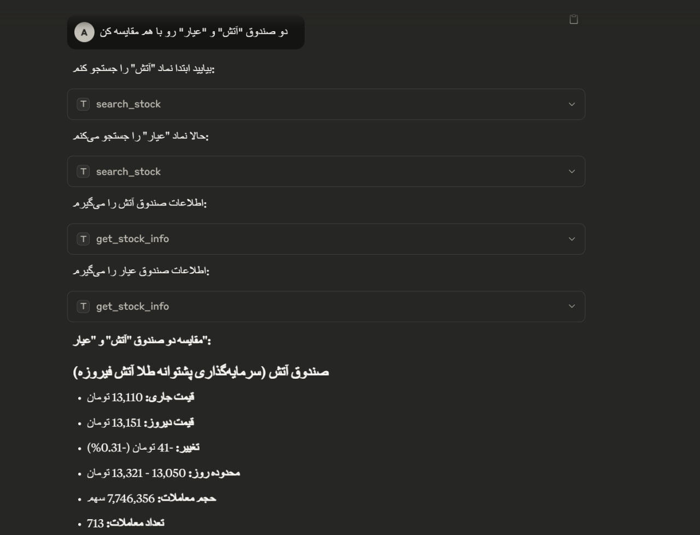
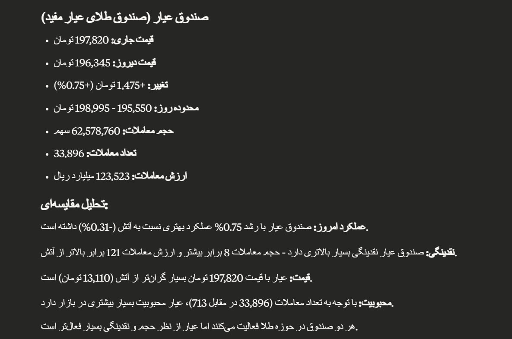

# TSE MCP Server

An MCP server to interact with Tehran Stock Exchange (TSE).

## Tools


*  **Search Stock**: Query stock names or symbols and receive a list of matching results.
*  **Get Stock Info**: Retrieve the latest trading data (open, close, high, low, volume, etc.) for a specific stock.
*  **Get Stock History**: Retrieve the historical trading data (open, close, high, low, volume, etc.) for a specific stock.

## MCP Server Setup


### Claude Desktop Configuration

Here is an example config file you can add to `claude_desktop_config.json` file.
```
{
  "mcpServers": {
    "Tehran Stock Exchange MCP": {
      "command": "uv",
      "args": [
        "--directory",
        "<PATH_TO_TSE_MCP_DIRECTORY>,
        "run",
        "server.py"
      ]
    }
  }
}

```
## Example





